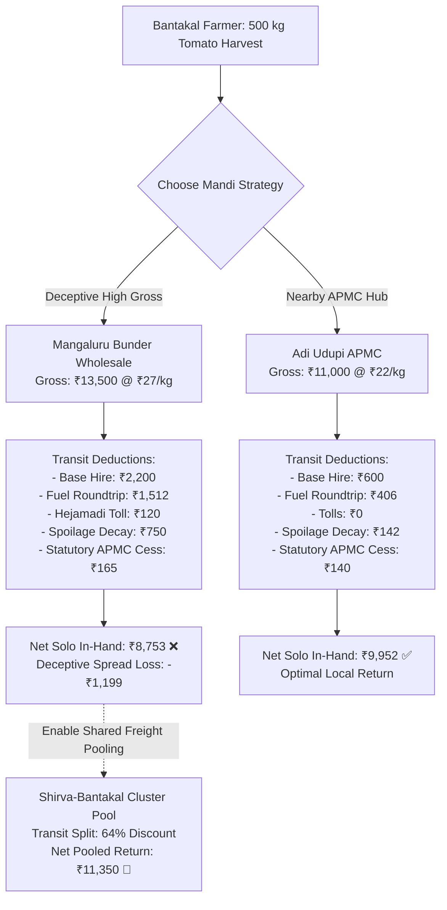
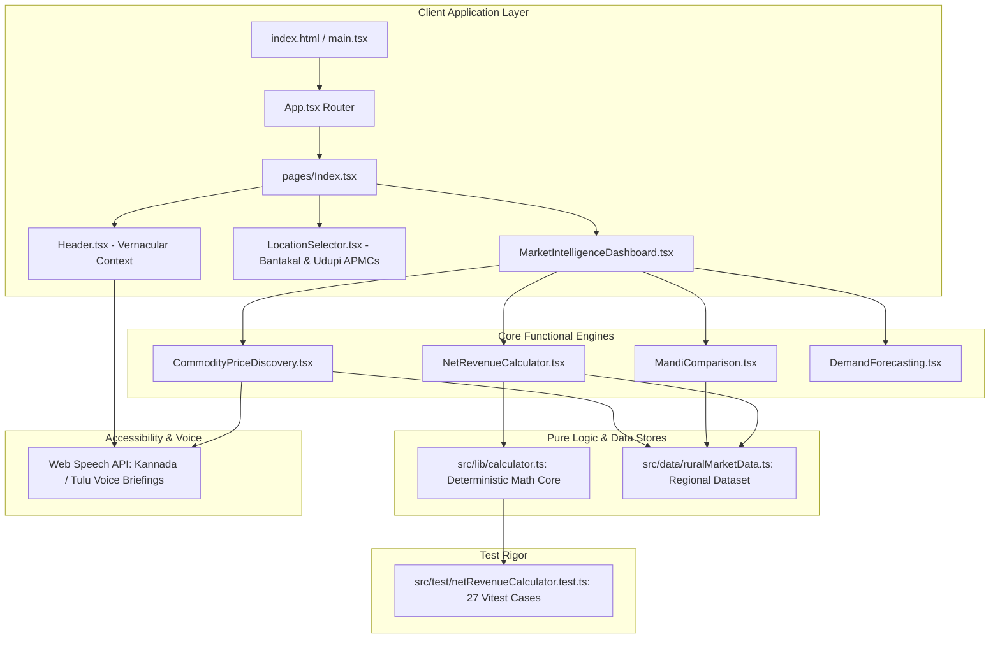

<div align="center">


# 🌾 VajraYield (ವಜ್ರ ಯೀಲ್ಡ್)

### Precision Rural Market Intelligence & Cooperative Freight Arbitrage Engine

**Hackathon Premier League (HPL) 2026 | SMVITM Bantakal**  
**Track:** PS 02 — Rural Market Intelligence & Spatial Arbitrage  
**Territory Focus:** Coastal Karnataka (*"Build For Udupi!"*)  
**Status:** Production Ready | 100% Passing Vitest Coverage (27/27 Tests)

---

[](https://vitejs.dev/)
[](https://reactjs.org/)
[](https://www.typescriptlang.org/)
[](https://tailwindcss.com/)
[](https://vitest.dev/)
[](#-5-differentiators--regional-alignment)

</div>

---

## 📌 1. Executive Summary & Problem Framing

Smallholder agricultural producers in Coastal Karnataka routinely fall victim to the **"Gross Modal Price Optical Illusion"**:

1. **The Deceptive Spread:** A terminal wholesale market like Mangaluru Central Bunder lists tomatoes at **₹27/kg (₹2,700/Qtl)**, while the local Adi Udupi APMC lists them at **₹22/kg (₹2,200/Qtl)**.
2. **The Hidden Drain:** Dispatching 500 kg of produce solo over 54 km incurs private mini-truck hire, roundtrip fuel expenses, highway toll fees, and transit decay accelerated by coastal humidity.
3. **The Unseen Realization:** The distant terminal market yields **less net cash in hand** than selling locally at Adi Udupi.

**VajraYield** resolves this problem. Decoupled from unreliable external APIs via a verified local cached baseline, VajraYield evaluates true net realization and offers cooperative cluster pooling to cut transport overhead.



---

## 🧮 2. The Core Mathematical Model

The decision engine runs deterministic, pure TypeScript calculations without floating-point errors.

### The Unified Realized Net Revenue Formula

**1. Gross Revenue**

$$R_{\text{gross}} = P_{\text{modal}} \times Q_{\text{kg}}$$

**2. Dynamic Freight Expense**

$$\text{Cost}_{\text{transit}} = \text{VehicleHire} + \text{Fuel}_{\text{roundtrip}} + \text{Toll} \quad \div \quad N_{\text{pooled farmers}}$$

**3. Coastal Perishability & Heat Decay**

$$\text{Loss}_{\text{spoilage}} = Q_{\text{kg}} \times P_{\text{modal}} \times k_{\text{decay}} \times \left(\frac{D_{\text{km}}}{v_{\text{rural}}}\right)$$

Where:
- $v_{\text{rural}} = 35\ \text{km/h}$ (standard coastal rural road velocity)
- $k_{\text{decay}}$ is the hourly crop loss factor:

| Crop | Decay Rate |
|---|---|
| Tomato | 0.025/hr (2.5%) |
| Mattu Gulla (GI-Tag Brinjal) | 0.018/hr (1.8%) |
| Shankarapura Jasmine | 0.050/hr (5.0%) |
| Arecanut (Supari) | 0.000/hr (Non-perishable) |

**4. Mandi Statutory Deductions**

$$\text{Cess}_{\text{APMC}} = R_{\text{gross}} \times r_{\text{cess}}$$

$$R_{\text{net}} = R_{\text{gross}} - \text{Cost}_{\text{transit}} - \text{Loss}_{\text{spoilage}} - \text{Cess}_{\text{APMC}}$$

---

## 📊 3. Verification: The 500 kg Tomato Dilemma

Comparison from Bantakal (SMVITM Campus Hub) origin with $500\ \text{kg}$ Tomato:

| Metric | Adi Udupi APMC (Local) | Mangaluru Central Bunder (Terminal) | Delta / Arbitrage Reality |
|---|---|---|---|
| Distance (One-Way) | 14.5 km | 54.0 km | +39.5 km |
| Transit Duration | 25 mins | 85 mins | +60 mins |
| Listed Modal Price | ₹2,200/Qtl (₹22/kg) | ₹2,700/Qtl (₹27/kg) | +₹500/Qtl *(Optical Trap)* |
| Gross Yield | ₹11,000 | ₹13,500 | +₹2,500 |
| Vehicle Hire + Fuel + Toll | ₹1,006 | ₹3,832 | +₹2,826 transit drag |
| Microclimate Spoilage | ₹142 | ₹750 | +₹608 humidity loss |
| APMC Cess + Hamali | ₹140 | ₹165 | +₹25 |
| **Net Solo In-Hand Cash** | **₹9,952 🟢** | **₹8,753 ⚠️** | **Adi Udupi wins by +₹1,199** |
| **Net Pooled Cash (3-Farmer Cluster)** | ₹10,480 | **₹11,350 🚀** | **Mangaluru becomes viable** |

---

## 🏛️ 4. System Architecture & Component Hierarchy



---

## 🌟 5. Differentiators & Regional Alignment

- **🗺️ Udupi Regional Grounding** (*"Build For Udupi!"*)  
  Pre-configured for farmer clusters in Bantakal, Shirva, Brahmavara, Karkala, and Kaup. Integrates regional GI-tagged cash crops: Mattu Gulla, Shankarapura Jasmine (Udupi Mallige), and Arecanut (Chali).

- **🚛 Shared Freight Pooling Radar**  
  Solves prohibitive vehicle hiring costs for smallholders through simulated 3-farmer cooperative pooling.

- **🗣️ Accessibility (A11Y) with Local Dialects**  
  One-touch voice briefings delivering spoken recommendations in Kannada (ಕನ್ನಡ) and Tulu (ತುಳು) via the native Web Speech API.

- **🔒 Resilient Local Baseline**  
  Avoids fragile live government scrapers during critical demonstrations, running O(1) calculations with verified baseline regional data.

---

## 🧪 6. Testing & Quality Assurance

The codebase includes automated unit tests covering all mathematical edge cases via Vitest:

```bash
# Execute the test suite
npm run test
```

### Test Scope (27 Passing Suites)

| Test Category | Description |
|---|---|
| ✅ Mathematical Accuracy | Confirms net revenues across varying quantities (50 kg to 2,000 kg) |
| ✅ Scenario Verification | Evaluates the 500 kg Tomato condition: `netReturn(Adi Udupi) > netReturn(Mangaluru)` |
| ✅ Pooling Efficiency | Verifies that toggling `isPooled: true` yields a >60% reduction in transport expenses |
| ✅ Input Validation | Handles negative weights, NaN, and zero quantities gracefully with standard fallback guards |

---

## 🚀 7. Installation & Local Development

### Prerequisites

- **Node.js:** v18.0.0 or higher
- **npm:** v9.0.0 or higher

```bash
# Clone the repository
git clone https://github.com/vineethbhatalevoor/VajraYield.git
cd VajraYield

# Install dependencies
npm install

# Run the Vitest test suite
npm run test

# Launch the local development server
npm run dev
```

Open your browser and navigate to:

```
http://localhost:8080/
```

---

## 👥 8. Squad Information & Hackathon Details

| Field | Details |
|---|---|
| **Event** | Hackathon Premier League (HPL) 2026 |
| **Host Institution** | Shri Madhwa Vadiraja Institute of Technology and Management (SMVITM), Bantakal, Udupi |
| **Problem Statement** | PS 02 — Rural Market Intelligence |
| **Squad Identity** | VajraYield |

---

<div align="center">

*Built with ❤️ for the farmers of Coastal Karnataka*

</div>
